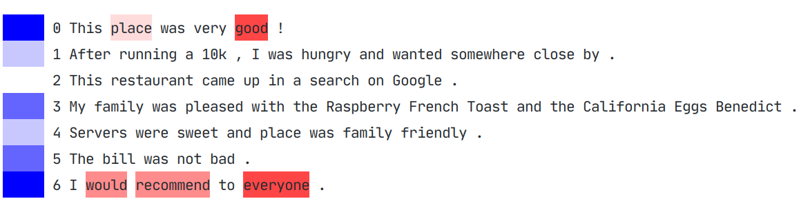
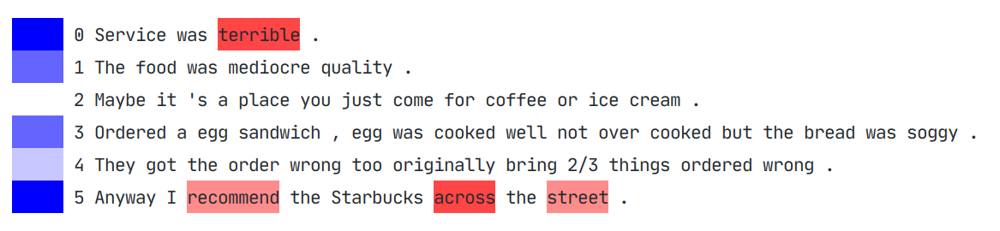

# Document Classification with HAN, LSTM and BERT

Thanks to Deep Learning, Natural Language Processing (NLP) has grown a lot over the past few years. This project deals 
with some of the latest techniques of Document Classification, an important task in NLP. It consists to assign a 
document to one category. If category is actually a _sentiment_ (a numeric evaluation of text), we talk about 
Sentiment Analysis, like datasets take in this implementation.

## This Project

In this project, we want to replicate some literature experiments and compare different approaches:

- **HAN** is a sophisticated model based on Recurrent Neural Networks, in particular GRU (special version to remember 
long term dependencies), combined with some hierarchical attention mechanisms, that consider words and sentences 
differently. The idea is to let the model to pay more or less attention to individual words and sentences when 
constructing the representation of document (required for classification) [1].

- **BERT** has an architecture based on Transformers: they are layers with strong multi-head attention and others 
techniques like positional encoding and residual connections, without RNNs. __Base__ version has 12 
transformers-encoders, while __Large__ has 24 [2].

- **LSTM** is a RNN architecture based on single bilateral LSTM layer (like GRU, LSTM has some gates to avoid vanishing 
gradient problem), with appropriate regularization and without attention mechanisms [3].

- **KD-LSTM**: same authors of previous model proposed a Knowledge Distillation version of their LSTM, thanks to BERT. 
The main idea is to use a big teacher model (BERT, in this case) to distill information to a smaller, faster, student 
network (LSTM) to achieve better results [4].

## Datasets

To test models, three Sentiment Analysis datasets was chosen:

- **IMDB Small**: short version of IMDB (about 25 000 film reviews), with only two sentiments: positive or negative. 
This dataset can be retrieved in TensorFlow datasets.

- **IMDB**: large version with about 135 000 reviews and 10 sentiments (stars from 1 to 10). It was found 
<a href="https://github.com/castorini/hedwig ">here</a>.

- **Yelp 2014**: dataset of restaurants reviews with sentiment from 1 to 5. I was harder to retrieve the right year 
version, so we downloaded the <a href="https://www.yelp.com/dataset">complete version<a> and we selected only 2014 
reviews by hand. Total reviews are about 900 000 versus 1 million in original dataset (maybe the original includes some 
2013 or 2015 data). Anyway results are similar. 

## Results

We report accuracy on test set for every dataset and model. BERT reaches better results, but it is also the heaviest 
network. LSTM also achieves good results, without attention mechanisms. Almost all tests are quite similar to cited 
papers results.

| Model       | IMDB Small | IMDB | Yelp 2014 |
|-------------|------------|------|-----------|
| HAN         | 86.6       | 42.5 | 69.0      |
| BERT_base   | 94.6       | 57.7 | 77.4      |
| LSTM_reg    | 94.2       | 52.7 | 71.1      |
| KD-LSTM_reg | 94.6       | 58.5 | 71.7      |

## Visualization of Attention in HAN

This code allows to visualize attention in HAN model (with `hanPredict` function), because it is relative easy to extract 
partial model weights to reconstruct the most attentioned words and sentences. Here two reviews from Yelp, blue 
represents most important sentences and red most relevant words.

<div>
<p align="center">

</p>
</div>

**HAN PREDICTION: 5, TARGET: 5**. Here the word _'bad'_ it has been well interpreted based on context.

<div>
<p align="center">

</p>
</div>

**HAN PREDICTION: 1, TARGET: 1**. They was attentioned the first and the last sentences, the word _'recommend'_ here has 
a different sense, because context is different.

## Reproducing Experiments

### Dependencies

This project uses PyTorch and Tensorflow 2 (only for HAN model), for training GPU is needed. Code was developed and 
tested with these main dependencies:

- Python 3.7.7
- numpy 1.18.1
- ntlk 3.4.5
- pandas 1.0.3
- pytorch 1.4.0
- tensorboard 2.1.0
- tensorflow 2.1.0
- transformers 2.10.0

All dependencies can be installed with command line:

```sh
$ pip install -r requirements.txt
```

After cloned this repository. For Han Preprocessing `glove.6B.100d.txt` is also required (for this project was chosen 
100 dimension version) that can be retrieved in <a href="https://nlp.stanford.edu/projects/glove/">GloVe site</a>.

### How make it works

The pipeline is getting the dataset in pandas dataframe format (there are some utils functions, they expect dataset in 
`datasets/` local directory), preprocessing (it automatically splits train, valid and test sets), training and 
evaluating. Here a `main.py` example:

```python
from preprocessing import bertPreprocessing
from train import lstmTrain
from utils import readIMDB

dataset_name, n_classes, data_df = readIMDB()

bertPreprocessing(dataset_name, data_df, MAX_LEN=128)
lstmTrain(dataset_name, n_classes, TRAIN_BATCH_SIZE=64, EPOCHS=20, LEARNING_RATE=1e-03)
```

Now logs are continuously saved and update. _Tensorboard_ is a good tool to tracking and visualizing metrics during 
training:

```sh
$ tensorboard --logdir logs/IMDB_lstm
```

At the end the model is saved in `models/model_IMDB_lstm/`, it is possible to evaluate model results on test set adding
the model path and running this function:

```python
from predict import lstmEvaluate

lstmEvaluate('IMDB', 10, model_path='models/model_IMDB_lstm/20200618-133908')
```

## Report

A copy of the report (italian) can be found 
<a href="https://github.com/FrancescoGradi/DocumentClassificationwithHANandBERT/blob/master/demo/relazioneMachineLearning.pdf">here</a>.


## References

[1] Zichao Yang, Diyi Yang, Chris Dyer, Xiaodong He, Alex Smola, and Eduard Hovy. 2016. Hierarchical attention networks 
for document classification. In _Proceedings of the 2016 Conference of the North American Chapter of the Association for 
Computational Linguistics: Human Language Technologies_, pages 1480–1489.

[2] Jacob Devlin, Ming-Wei Chang, Kenton Lee, and Kristina Toutanova. 2019. BERT: pre-training of deep bidirectional 
transformers for language understanding. In _Proceedings of the 2019 Conference of the North American Chapter of the 
Association for Computational Linguistics: Human Language Technologies_, Volume 1 (Long and Short Papers), pages 
4171–4186.

[3] Ashutosh Adhikari, Achyudh Ram, Raphael Tang, and Jimmy Lin. 2019. Rethinking complex neural network architectures 
for document classification. In _Proceedings of the 2019 Conference of the North American Chapter of the Association for 
Computational Linguistics: Human Language Technologies_, Volume 1 (Long and Short Papers), pages 4046–4051.

[4] Ashutosh Adhikari, Achyudh Ram, Raphael Tang, and Jimmy Lin. 2019. _DocBERT: BERT for Document Classification._ Arvix.